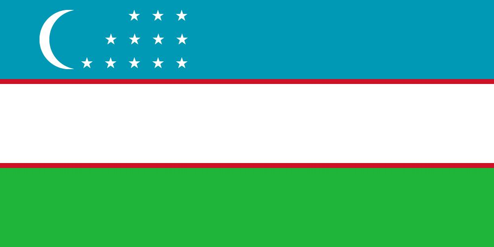

    

## About Me

- 🌍 **Location:** Samarkand, Uzbekistan
- 🎓 **Education:** Samarkand State University, Software Engineering, 3rd Year Student
- 💻 **Occupation:** Full-Stack Developer
- 🚀 **Experience:** 3+ Years in Programming
- 🔗 **Website:** [iqbolshoh.uz](https://iqbolshoh.uz)
- ✉️ **Contact:** [iilhomjonov777@gmail.com](mailto:iilhomjonov777@gmail.com) | <a href="tel:+9989997799333">Tell: +998(99)7799333</a>

### 🌐 Languages I Speak

<ul style="list-style-type: none; padding: 0; margin: 20px; max-width: 300px;">
    <li style="display: flex; align-items: center; margin-bottom: 10px; font-size: 18px; color: #333;">
        Tajik 
    </li>
    <li style="display: flex; align-items: center; margin-bottom: 10px; font-size: 18px; color: #333;">
        Persian 
    </li>
    <li style="display: flex; align-items: center; margin-bottom: 10px; font-size: 18px; color: #333;">
        Uzbek 
    </li>
    <li style="display: flex; align-items: center; margin-bottom: 10px; font-size: 18px; color: #333;">
        Russian 
    </li>
    <li style="display: flex; align-items: center; margin-bottom: 10px; font-size: 18px; color: #333;">
        English 
    </li>
</ul>

## Technologies

I have worked with a variety of programming languages and frameworks, which allows me to build robust and scalable
applications. 🚀💻

### 💻 Programming Languages:

    
    
    
    
    

### 🎨 Frontend Technologies:

    
    
    
    
    

### 📚 Frameworks and Libraries:

    
    
    
    
    
    

### 🗄️ Databases:

    
    
    

### 🏆 Coding Profiles:

    <a href="https://www.codewars.com/users/Iqbolshoh_777" target="_blank">Codewars</a> |
    <a href="https://leetcode.com/Iqbolshoh_777" target="_blank">LeetCode</a> |
    <a href="https://codeforces.com/profile/Iqbolshoh_777" target="_blank">Codeforces</a> |
    <a href="https://kep.uz/profile/Iqbolshoh_777" target="_blank">Kep.uz</a> |
    <a href="https://robocontest.uz/profile/Iqbolshoh_777" target="_blank">Robocontest.uz</a>

## GitHub Stats

## Top Languages

## Top Repositories

## GitHub Trophy

    
    
    

## Connect with Me

I love connecting with new people and exploring new opportunities. Feel free to reach out to me through any of the platforms below:

<table>
    <tr>
        <td>
            
        </td>
        <td>
            
        </td>
        <td>
            
        </td>
        <td>
            
        </td>
        <td>
            
        </td>
        <td>
            
        </td>
        <td>
            
        </td>
    </tr>
</table>
