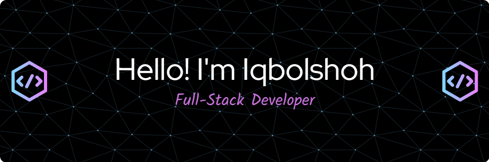
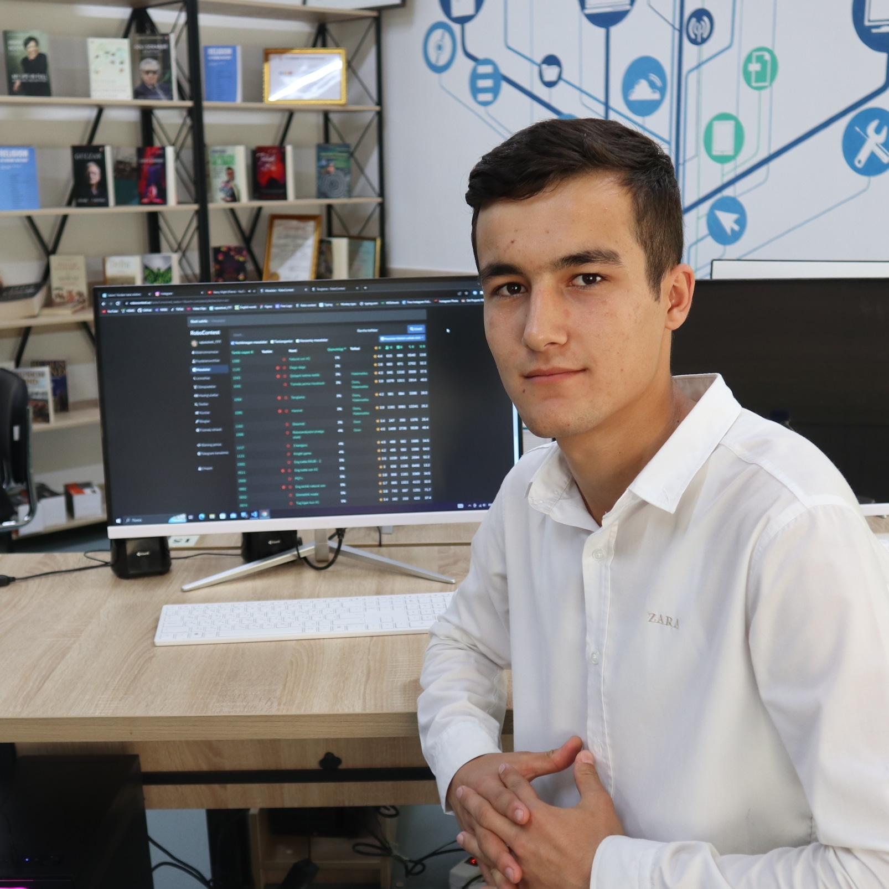
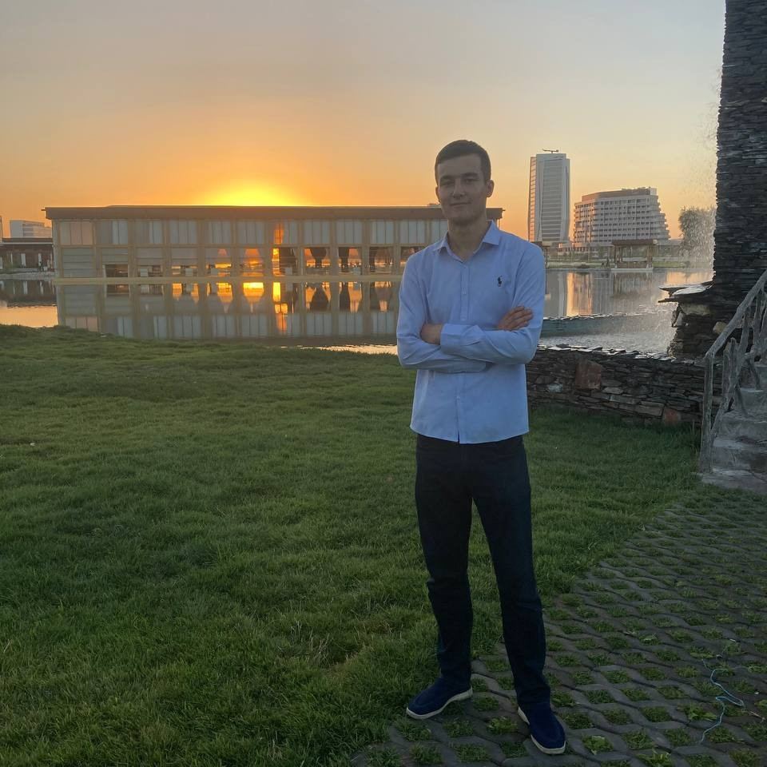
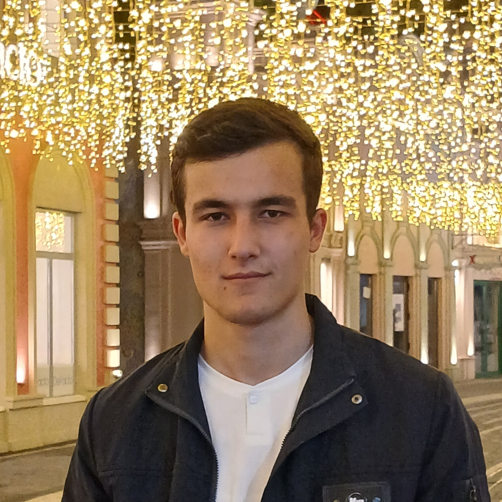
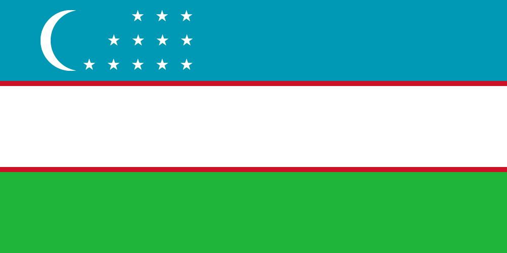

  

  

✨ I'm <strong>Iqbolshoh Ilhomjonov</strong>, a passionate Full-Stack Developer and 4th-year Software Engineering student from the legendary city of <strong>Samarkand, Uzbekistan</strong>.
With over 3 years of experience, I specialize in building seamless, user-centric digital experiences — blending creativity and clean code. 🚀

  
  
  

<table align="center">
  <tr>
    <td align="center">
       
      <strong>Location</strong> 
      Samarkand, Uzbekistan
    </td>
    <td align="center">
       
      <strong>Education</strong> 
      4th-Year Student Samarkand State University
    </td>
    <td align="center">
       
      <strong>Profession</strong> 
      Full-Stack Developer
    </td>
  </tr>
</table>

## 🗣️ Languages I Speak

  <table>
    <tr>
      <td align="center">
        
        
<strong>Tajik</strong>

      </td>
      <td align="center">
        
        
<strong>Persian</strong>

      </td>
      <td align="center">
        
        
<strong>Uzbek</strong>

      </td>
      <td align="center">
        
        
<strong>Russian</strong>

      </td>
      <td align="center">
        
        
<strong>English</strong>

      </td>
    </tr>
  </table>

## 📬 Connect with Me
💬 I love meeting new people and discussing tech, business, and creative ideas. Let's connect! You can reach me on these platforms:

## 🏆 Programming Ratings

  <table>
    <tr>
      <td>
        
      </td>
      <td>
        
      </td>
      <td>
        
      </td>
      <td>
        
      </td>
      <td>
        
      </td>
    </tr>
  </table>

---

## 🚀 Technologies

### 💻 Programming Languages

---

### 🎨 Frontend Technologies

---

### 📚 Frameworks & Libraries

---

### 🗄️ Databases

---

### 🛠️ Developer Tools & Platforms

---

### ☁️ Cloud & CI/CD

---

    

## 📊 GitHub Stats

## 🏆 GitHub Trophy

## 📈 Top Languages

    
    

## 🚀 Top Repositories

